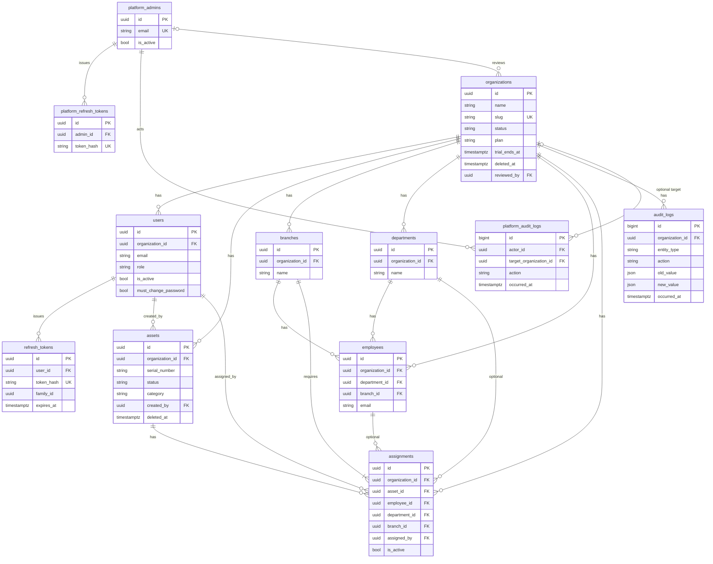

# AssetVault — Bank Office Asset Management Platform

**Every asset. Every moment. Under control.**

AssetVault is a production-grade asset management platform built for banking and enterprise environments. It covers the full lifecycle of IT, office, and infrastructure assets — registration, assignment, status tracking, QR code generation, audit logging, and analytics dashboards.

---

## Tech Stack

### Backend
- **Python 3.12** + **FastAPI** (async REST API)
- **SQLAlchemy 2.0** (async ORM) + **PostgreSQL 17**
- **Alembic** (database migrations)
- **JWT** authentication (python-jose + passlib/bcrypt)
- **QR code generation** (qrcode + Pillow)
- **Pydantic v2** (request/response validation)

### Frontend
- **React 19** + **TypeScript**
- **Vite 8** (build tool)
- **Tailwind CSS v4** (custom design system)
- **Recharts** (analytics charts)
- **TanStack Query v5** (server state)
- **Zustand** (client state)
- **React Router v6** (routing)
- **React Hook Form** + **Zod** (form validation)
- **Framer Motion** (animations)
- **html5-qrcode** (camera-based QR scanner)

### Infrastructure
- **Docker Compose** (PostgreSQL, Redis, backend, frontend, Nginx)
- **Nginx** (reverse proxy)

---

## Run Locally

You have two options: **Docker** (one command, nothing else to install) or a **native** setup (run the backend and frontend directly).

### Option A — Docker (easiest)

Requires only Docker Desktop. Brings up PostgreSQL, Redis, the backend, and the frontend together:

```bash
git clone <repo-url>
cd asset-management
docker compose up --build
```

- **App**: http://localhost
- **Frontend dev server**: http://localhost:5173
- **API docs**: http://localhost:8000/docs

Seed the database once the stack is up:

```bash
docker compose exec backend python seed.py
```

### Option B — Native setup

#### Prerequisites
- **Python 3.10–3.13** (3.13 recommended)
- **Node.js 20.19+** (or 22+ — required by Vite 8)
- **PostgreSQL 15+** running locally (or just run `docker compose up -d db` to use the containerized DB)

> **macOS note:** the system Python is 3.9, which is **too old** (the backend uses `X | None` syntax that needs 3.10+). The most reliable way to get a clean interpreter is [`uv`](https://github.com/astral-sh/uv): `brew install uv`.

#### 1. Backend

```bash
git clone <repo-url>
cd asset-management

# --- create the virtual environment ---
# Recommended (uv, pins a standalone Python 3.13):
uv venv --python 3.13 --seed venv
source venv/bin/activate
uv pip install -r backend/requirements.txt

# --- or, standard venv (needs Python 3.10+ on PATH) ---
# python3 -m venv venv
# source venv/bin/activate
# pip install -r backend/requirements.txt
```

Create `backend/.env`:

```env
DATABASE_URL=postgresql+asyncpg://postgres:<password>@localhost:5432/assetvault
SYNC_DATABASE_URL=postgresql://postgres:<password>@localhost:5432/assetvault
# Required: at least 32 bytes; not a known placeholder. Example:
#   openssl rand -hex 32
JWT_SECRET=local-dev-only-jwt-secret-do-not-use-in-prod
SEED_PASSWORD=YourSecurePass1
REDIS_URL=redis://:local-dev-only-redis-pass@localhost:6379/0
```

See `.env.example` at the repo root for the full Compose/production variable list.

Create and seed the database, then start the API:

```bash
createdb assetvault           # or: psql -U postgres -c "CREATE DATABASE assetvault;"

cd backend
# SEED_PASSWORD is required when creating the initial users (skip if already seeded)
SEED_PASSWORD='YourSecurePass1' python seed.py
../venv/bin/uvicorn app.main:app --reload --port 8000
```

#### 2. Frontend

```bash
cd frontend
npm install
npm run dev
```

#### 3. Open in browser

- **Frontend**: http://localhost:5173
- **API docs**: http://localhost:8000/docs

> The Vite dev server proxies `/api` to the backend on port 8000 (see `frontend/vite.config.ts`), so no extra CORS config is needed for local development.

### Troubleshooting

- **`seed.py` fails with "password cannot be longer than 72 bytes"** — a bcrypt/passlib mismatch. `bcrypt` is pinned `<5` in `requirements.txt`; reinstall deps if you see this. The harmless `error reading bcrypt version` warning can be ignored.
- **`TypeError: unsupported operand type(s) for |` on startup** — your Python is older than 3.10. Recreate the venv with `uv venv --python 3.13 --seed venv`.
- **Frontend `npm install` peer-dependency conflict** — the build tooling is aligned on Vite 8 + `@tailwindcss/vite` 4.3+. Make sure `package.json` isn't pinning an older Vite.

---

## Deployment (Production)

Live hosts (Let's Encrypt HTTPS):

| Host | Role |
|------|------|
| `https://app.assetvault.uz` | Shared tenant SPA — workspace **finder** only (no password login, no JWT) |
| `https://{slug}.assetvault.uz` | Customer workspace — password login and the dashboard |
| `https://demo.assetvault.uz` | Seeded demo workspace |
| `https://admin.assetvault.uz` | Platform operator console |
| `https://assetvault.uz` | Marketing / apex (same tenant SPA as `app.`) |
| `https://asset.datamou.uz` | Legacy VC host — **301** to `https://app.assetvault.uz` |

JWT access tokens live in `localStorage` (origin-scoped). Password login is issued only on `{slug}.{BASE_DOMAIN}`. Shared hosts (`app.`, apex, `www`, `admin`) never mint tenant tokens; the finder looks up `{slug, name}` and then navigates to `https://{slug}.{BASE_DOMAIN}/login`.

During the `datamou.uz` → `assetvault.uz` cutover both apexes can be served together via `BASE_DOMAIN` + `LEGACY_BASE_DOMAIN` (see root `.env.example`).

Deployed with Docker Compose on a Linux host using `docker-compose.prod.yml`, which differs from the local compose file:

- **web** — multi-stage build (`frontend/Dockerfile.prod`): Vite builds the tenant SPA and the platform console (`npm run build` + `npm run build:admin`), served by unprivileged Nginx (container ports 8080/8443 → host 80/443). Nginx config is an **envsubst template** (`frontend/nginx.conf.template`) rendered at container start from `NGINX_SERVER_NAMES`, `NGINX_PLATFORM_SERVER_NAMES`, `NGINX_LEGACY_REDIRECT_NAMES`, and `TLS_CERT_NAME`. Tenant `server_name` includes `*.assetvault.uz`; the exact `admin.` name still wins for the platform SPA. Public `/docs`, `/openapi.json`, and `/redoc` are blocked at nginx.
- **backend / db / redis** — same images as local, but the DB and Redis ports are **not** published to the host. Redis requires `REDIS_PASSWORD`. Backend CORS allows explicit localhost origins plus an anchored regex `https://({label}.)?{BASE_DOMAIN|LEGACY_BASE_DOMAIN}` so arbitrary workspace origins work with credentials.
- **Secrets** (`POSTGRES_PASSWORD`, `JWT_SECRET`, `REDIS_PASSWORD`, `GROQ_API_KEY`) live in a server-only `.env` next to the compose file — never committed. Production compose sets `SKIP_SEED=1`. Pass `SEED_PASSWORD` only when you intentionally seed (no prod default). Set `BASE_DOMAIN`, `APP_SUBDOMAIN=app`, `PLATFORM_SUBDOMAIN=admin`, and optionally `LEGACY_BASE_DOMAIN`, `TLS_CERT_NAME`, `NGINX_SERVER_NAMES`.

```bash
# on the server
docker compose -f docker-compose.prod.yml up -d --build
# first run only — sample inventory lands on slug `demo`, not `default`
docker compose -f docker-compose.prod.yml exec -T -e SEED_PASSWORD="$SEED_PASSWORD" -e SKIP_SEED=0 backend python seed.py
```

TLS: named hosts (`app`, `demo`, `admin`, apex, `asset.datamou.uz`) are covered by an HTTP-01 Let's Encrypt certificate. **Wildcard** `*.assetvault.uz` requires DNS-01; without it, new org subdomains will show a browser warning until a wildcard cert is issued. `TLS_CERT_NAME` is the Let's Encrypt `live/` directory name and may differ from `BASE_DOMAIN`.

> `deploy.sh` is a **legacy** HTTP/systemd path on port 8012; prefer `docker-compose.prod.yml`.

---

## Seed accounts

After a successful `seed.py` run, sample inventory lives in the **demo** org
(slug `demo`). The reserved slug `default` still exists for migration backfill
but is **not** a bindable tenant host. Log in at `https://demo.assetvault.uz` as
`admin@assetvault.uz`, `manager@assetvault.uz`, or `auditor@assetvault.uz`.
Their password is whatever you set in `SEED_PASSWORD` for that run — it is not
published in this README.

New tenant users must be created by an **ADMIN** in Settings (or via `POST /api/auth/users`).
Public self-registration of *users* is disabled. Organizations apply on a shared
host (`/signup` on `app.` / localhost) and wait for platform activation. Signup
is refused on any bound workspace host.

---

## Features

### Authentication & Roles
- JWT-based auth with access/refresh tokens (30 min / 7 days)
- Four tenant roles: **Admin**, **Manager**, **Viewer**, **Auditor** (platform operators are a separate identity)
- Host binding: `{slug}.{BASE_DOMAIN}` is the workspace; `app.` / apex / `admin.` / `www` are unbound
- Shared-host login returns **403** (finder only). Bound-host login forces that slug
- Role-based access control on all endpoints and UI routes
- Tenant **ADMIN** creates users in Settings with a temporary password; the user must change it on first login
- Tenant **ADMIN** can reset another user's password (also forces a change on next login)

### Future plans
- Azure AD / Microsoft Entra ID SSO and employee/department directory sync (Enterprise)
- Email invites (instead of sharing a temporary password)

### Asset Management
- Full CRUD with soft delete
- 9 asset categories: IT, Office, Security, Networking, Printing, Server, Mobile, Furniture, Other
- Enforced status state machine:
  ```
  REGISTERED → ASSIGNED, IN_REPAIR, WRITTEN_OFF
  ASSIGNED   → REGISTERED, IN_REPAIR, LOST
  IN_REPAIR  → ASSIGNED, REGISTERED, WRITTEN_OFF
  LOST       → WRITTEN_OFF (only)
  WRITTEN_OFF → (terminal)
  ```
- Invalid transitions return HTTP 409

### Assignment & Ownership
- Assign assets to employees or departments
- Single active assignment enforced per asset
- Auto status transitions on assign/return
- Full assignment history per asset

### QR Codes
- Auto-generated QR code PNG for each asset
- Contains JSON payload: id, name, serial, category, status, assignee
- Camera-based QR scanner page (mobile-friendly)

### Audit Log
- Immutable, append-only audit trail
- Tracks: asset CRUD, status changes, assignments, returns, logins
- Expandable JSON diff view (old/new values)
- CSV export for auditors

### Analytics Dashboard
- Asset value over time (line chart)
- Status breakdown over time (stacked area chart)
- Department allocation (horizontal bar chart)
- Age distribution histogram
- Repair frequency table (top 10)
- Warranty expiry calendar (90-day lookahead)

### Dashboard
- KPI cards with animated counters: Total, Assigned, In Repair, Lost, Written Off
- Status distribution donut chart
- Category breakdown bar chart
- Recent activity feed (auto-refreshes every 30s)
- Department utilization with progress bars

---

## Project Structure

```
assetvault/
├── backend/
│   ├── app/
│   │   ├── main.py              # FastAPI app, CORS, routers, exception handlers
│   │   ├── config.py            # Settings (pydantic-settings, reads .env)
│   │   ├── database.py          # Async SQLAlchemy engine + session
│   │   ├── dependencies.py      # get_db, get_current_user, require_role
│   │   ├── exceptions.py        # Custom HTTP exceptions
│   │   ├── models/              # SQLAlchemy ORM models
│   │   ├── schemas/             # Pydantic request/response schemas
│   │   ├── routers/             # API route handlers
│   │   └── services/            # Business logic (incl. host_tenant host binding)
│   ├── alembic/                 # Database migrations (schema authority)
│   ├── tests/                   # pytest (isolated assetvault_test database)
│   ├── seed.py                  # Faker-based data seeder (demo org)
│   ├── requirements.txt
│   └── Dockerfile
├── frontend/
│   ├── src/
│   │   ├── components/          # UI components + layout
│   │   ├── pages/               # Route pages (tenant + platform admin)
│   │   ├── lib/                 # API client, host/config helpers
│   │   ├── stores/              # Zustand auth store
│   │   ├── types/               # TypeScript interfaces
│   │   ├── App.tsx              # Router + providers
│   │   └── index.css            # Tailwind + design tokens
│   ├── vite.config.ts
│   ├── vite.admin.config.ts     # Platform console entry
│   ├── nginx.conf.template      # Prod nginx (envsubst)
│   └── Dockerfile.prod
├── docker-compose.yml           # Local stack
├── docker-compose.prod.yml      # Production stack
└── README.md
```

---

## API Endpoints

### Auth
| Method | Endpoint                              | Description                                      |
|--------|---------------------------------------|--------------------------------------------------|
| POST   | /api/auth/signup                      | Public trial application (shared hosts only)     |
| GET    | /api/auth/tenant                      | Workspace `{slug, name}` from `Host` (or 404)    |
| POST   | /api/auth/workspaces                  | List usable workspaces for an email (finder)     |
| POST   | /api/auth/login                       | Login, get tokens (bound tenant host in prod)    |
| POST   | /api/auth/refresh                     | Refresh token                                    |
| GET    | /api/auth/me                          | Current user (host must match the token's org)   |
| POST   | /api/auth/logout                      | Logout                                           |
| POST   | /api/auth/change-password             | Change own password                              |
| GET    | /api/auth/users                       | List org users (ADMIN)                           |
| POST   | /api/auth/users                       | Create org user (ADMIN)                          |
| PATCH  | /api/auth/users/{id}                  | Update role / active (ADMIN)                     |
| POST   | /api/auth/users/{id}/reset-password   | Reset password (ADMIN)                           |

### Assets
| Method | Endpoint                   | Description              |
|--------|----------------------------|--------------------------|
| GET    | /api/assets                | List (paginated, filter) |
| POST   | /api/assets                | Create asset             |
| GET    | /api/assets/{id}           | Get detail               |
| PUT    | /api/assets/{id}           | Update asset             |
| DELETE | /api/assets/{id}           | Soft delete              |
| PATCH  | /api/assets/{id}/status    | Change status            |
| GET    | /api/assets/{id}/qr        | Get QR code PNG          |
| GET    | /api/assets/{id}/history   | Asset audit trail        |

### Assignments
| Method | Endpoint                    | Description    |
|--------|-----------------------------|----------------|
| POST   | /api/assets/{id}/assign     | Assign asset   |
| POST   | /api/assets/{id}/return     | Return asset   |

### Audit
| Method | Endpoint           | Description          |
|--------|--------------------|----------------------|
| GET    | /api/audit         | List logs (filtered) |
| GET    | /api/audit/export  | Export CSV            |

### Analytics
| Method | Endpoint                             | Description              |
|--------|--------------------------------------|--------------------------|
| GET    | /api/analytics/overview              | KPI summary              |
| GET    | /api/analytics/value-over-time       | Cumulative value chart   |
| GET    | /api/analytics/status-over-time      | Status trends            |
| GET    | /api/analytics/department-allocation | Assets per department    |
| GET    | /api/analytics/age-distribution      | Asset age histogram      |
| GET    | /api/analytics/repair-frequency      | Most repaired assets     |
| GET    | /api/analytics/warranty-expiring     | Expiring warranties      |

### Reference Data
| Method | Endpoint          | Description    |
|--------|-------------------|----------------|
| GET    | /api/employees    | List employees |
| GET    | /api/departments  | List depts     |
| GET    | /api/branches     | List branches  |

---

## Database ER model

PostgreSQL. Tenant rows are scoped by `organization_id`. Assets use **soft delete** (`deleted_at`). `audit_logs` and `platform_audit_logs` are **append-only** (no UPDATE/DELETE). Alembic is the only schema authority.



Organization `status` values: `pending_review`, `rejected`, `trialing`, `active`, `past_due`, `suspended`, `deleted`. Tenant login and workspace lookup only surface `trialing`, `active`, and `past_due`.

---

## Tests

Backend tests talk to an isolated Postgres database `assetvault_test` (created automatically). They ignore compose `BASE_DOMAIN` so local/dev email login still works unless a test monkeypatches it.

```bash
# from backend/, with Postgres reachable (PG_HOST defaults to localhost)
cd backend && pytest

# against the Compose Postgres service (uses DATABASE_URL already injected by compose)
docker compose -f docker-compose.prod.yml run --rm --no-deps \
  -e PG_HOST=db \
  --entrypoint pytest backend
```

Frontend unit tests and a production-parity typecheck:

```bash
cd frontend
npx vitest run
npx tsc -b --pretty false
```

---

## Seed Data

The `seed.py` script generates:
- **5 branches**: HQ Tashkent, Samarkand, Namangan, Bukhara, Fergana
- **8 departments**: IT, HR, Finance, Security, Operations, Legal, Customer Service, Management
- **30 employees** across departments and branches
- **300 assets** with realistic status distribution (~60% assigned, ~15% registered, ~10% in repair, ~8% lost, ~7% written off)
- **~220 assignments** with history
- **~900 audit log entries**
- **3 users** (admin, manager, auditor)

---

## Design System

Dark vault aesthetic with amber/gold accents:

- **Background**: `#0A0A0F` (vault black)
- **Surface**: `#12121A` (cards/panels)
- **Accent**: `#F59E0B` (amber/gold)
- **Fonts**: Syne (headings), IBM Plex Sans (body), JetBrains Mono (codes/IDs)
- **Status colors**: Green (assigned), Yellow (in repair), Red (lost), Gray (registered/written off)

---

## License

Internal use. Not for redistribution.
